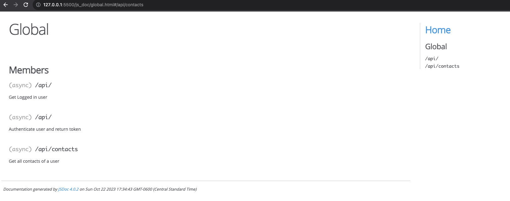
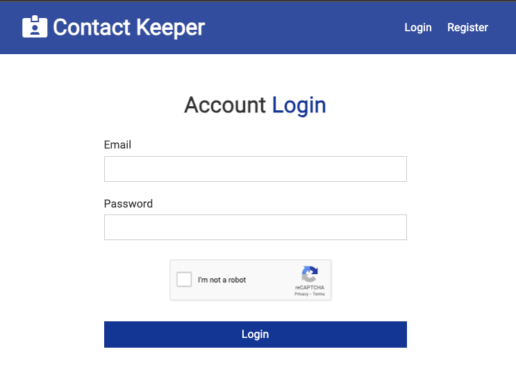

### contact-keeper-webpack

Simple CRUD app built with React and NodeJs backend. Context is used for state management. Mongo cloud is for persistence. Jwt is for auth and babel-webpack for transpiling and bundling.
Recaptcha2 is to avoid some bored QA taking advantage of it :)

#### Sample output from jsdoc

#### It would look like..

#### Webapp is live at render

<a href='https://simplecontacts.onrender.com/login'>contacts-manager</a>
